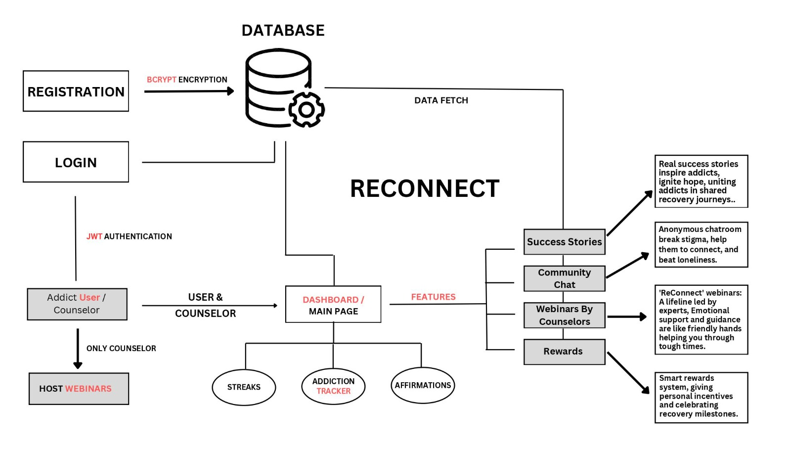

# ReConnect: Rehabilitation Online

## Overview

Welcome to ReConnect: Rehabilitation Online - a revolutionary tech-driven platform designed to empower individuals in their journey to overcome addiction seamlessly. This README file provides an insightful overview of the innovative features and functionalities offered by ReConnect.

### ReConnect: Rehabilitation Online

ReConnect is a comprehensive and technologically enriched rehabilitation experience. It transcends conventional approaches, offering a personalized and supportive environment for individuals seeking recovery. The platform is meticulously designed to tackle social stigma, privacy concerns, geographical limitations, and cost barriers.

## Features of the Web Application

### 1. Authentication for Users and Counsellors

ReConnect ensures utmost confidentiality and trust with user authentication and multi-layered security protocols, establishing an impenetrable fortress.

### 2. User Dashboard

An intuitive dashboard tracks progress, tasks, and customized schedules based on withdrawal stages. Inspirational affirmations and motivational quotes dynamically adapt to each user's unique journey.

### 3. Weekly Webinars

Live lifeline webinars led by caring experts provide support, shared stories, and hope. It's a rhythmic gathering where seasoned counselors share wisdom, fostering a warm community.

### 4. Community Chat Rooms

Anonymous chat spaces encourage connections, enabling users to share experiences, provide support, and conquer isolation perpetuated by social stigma.

### 5. Success Stories (Blogs)

Real-life triumphs showcased in blogs give hope and initiate a collective sense of achievement, reminding users they are not alone on the path to recovery.

### 6. Rewards System

An advanced rewards system adapts to individual preferences, offering personalized incentives and celebrating milestones in the recovery journey.

### 7. Daily Streak and Addiction Tracker

Gamification elements, including visually appealing streak counters and an insightful addiction tracker, provide real-time feedback, promoting a sense of accomplishment and awareness.

### 8. Notifications

Crafted with empathy, user-centric notifications offer motivational support, strategically timed to align with routines, celebrating progress, providing event reminders, and contributing to a personalized, encouraging environment.

### 9. Gratitude Section

Reflect on daily positives with the gratitude section, fostering a positive mindset throughout the recovery journey.

### 10. Sunday Wrapped - Weekly Performance Report

A detailed "Sunday Wrapped" report focuses on weekly achievements, areas for improvement, and personalized insights, encouraging self-reflection and goal improvement.

## Conclusion

ReConnect: Rehabilitation Online is more than a website; it's a friendly guide providing a safe and caring space with features like progress tracking, weekly reports, and a supportive community. With security and personalized tools, it simplifies the journey to recovery. ReConnect is not just a platform; it's a friend cheering users on every step, a simple, helpful, and positive place for people to find support and reclaim a happy life.

# Technology Stack

ReConnect: Rehabilitation Online leverages a powerful and modern technology stack to deliver a seamless and engaging user experience. Here's an overview of the key technologies and their roles in the application:

- **MongoDB**
  - *Role*: Database for storing user profiles, progress data, and other application-related information.

- **Express.js**
  - *Role*: Server framework facilitating the development of robust and scalable RESTful APIs for communication between the frontend and backend.

- **React.js**
  - *Role*: Frontend library for building a dynamic and responsive user interface, powering the user dashboard, success stories, and other interactive elements.

- **Node.js**
  - *Role*: Server-side runtime environment executing JavaScript code, coordinating the server-side logic, and handling requests from the frontend.

- **Socket.io**
  - *Role*: Enables real-time communication in chat rooms, fostering a sense of community and connection among users.

- **WebSockets**
  - *Role*: Facilitates live interaction during weekly webinars, creating a seamless and immersive experience for users.

- **JWT (JSON Web Tokens)**
  - *Role*: Implements secure user authentication, ensuring confidentiality and trust in user interactions.

- **Mongoose**
  - *Role*: An ODM (Object Data Modeling) library for MongoDB, simplifying interactions with the database and enhancing data validation.

- **Material-UI**
  - *Role*: Utilized for building a visually appealing and user-friendly interface, enhancing the overall user experience.

This robust technology stack ensures the reliability, security, and scalability of ReConnect, providing users with an innovative and effective platform for addiction recovery.

